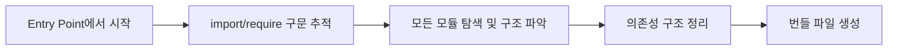

# 🌳 Tree Shaking - "코드를 흔들어 가볍게"

[](https://www.ecma-international.org/ecma-262/)
[](https://webpack.js.org/)


> **사용되지 않는 코드(dead code)를 제거하여 번들 크기를 최적화하는 기법**

## 📖 목차

1. [번들링이란?](#번들링이란)
2. [번들링 최적화 기법 - Tree Shaking](#번들링-최적화-기법---tree-shaking)
3. [Tree Shaking의 원리와 고려사항](#tree-shaking의-원리와-고려사항)
4. [Tree Shaking in RollupJS](#tree-shaking-in-rollupjs)
5. [정리](#정리)

---

## 🔧 번들링이란?

### 번들(Bundle)의 의미

**Bundle = 묶음**이라는 뜻으로, 번들러는 **필요한 여러 모듈들을 하나로 묶는 도구**입니다.

### 번들러 없이 개발할 때의 문제점

간단한 계산기 예제를 통해 문제점을 살펴보겠습니다.

#### ❌ 전역 변수 충돌 문제
```javascript
// add.js
const firstInput = document.getElementById('input1');

// minus.js  
const firstInput = document.getElementById('input1'); // 전역 변수 충돌!
```

#### ❌ 네트워크 요청 문제
- 파일마다 개별 HTTP 요청 필요
- 파일 수 증가 시 요청 병목 현상

#### ❌ 수동 의존성 관리의 한계
```html
<!-- HTML에서 스크립트 순서를 수동으로 관리해야 함 -->
<script src="add.js"></script>
<script src="minus.js"></script>
<script src="main.js"></script>
```

**더 많은 기능이 추가되면?**
- ⚠️ 순서 의존성 증가
- ⚠️ 모듈 관계 복잡화
- ⚠️ 모든 코드가 브라우저로 전송 (불필요한 코드 포함)
- ⚠️ 유지보수 불가능

### 🎯 번들러를 사용하는 이유

✅ **요청 수 감소** - 여러 파일을 하나로 합쳐 네트워크 요청 최소화  
✅ **로딩 속도 향상** - 번들된 파일의 효율적인 로딩  
✅ **캐싱 최적화** - 번들된 파일 하나만 캐시  
✅ **유지보수성과 배포 효율성** - 개발할 때는 모듈화, 배포할 때는 성능 최적화

### 번들링 과정



**구체적인 3단계:**
1. **모듈 탐색** - Entry point부터 의존성 그래프 생성
2. **의존성 구조 정리** - 모듈 간의 관계와 실행 순서 파악
3. **번들 파일 생성** - 하나의 최적화된 파일로 통합

---

## 🎯 번들링 최적화 기법 - Tree Shaking

### 주요 최적화 기법들

✅ **Tree Shaking**: 사용하지 않는 코드(import) 제거  
✅ **Code Splitting**: 한 파일을 여러 개의 작은 파일로 나누기  
✅ **Minification**: 공백 / 주석을 없애서 크기 줄이기

### Code Splitting의 효과

**Before (No Code Splitting):**
- 모든 기능을 한 번에 로드
- 초기 로딩 시간 증가

**After (Code Splitting):**
- 필요에 따라 지연 로딩
- 초기 로딩 성능 향상

```javascript
// React에서의 Code Splitting 예시
import React, { Suspense } from "react";

const LazyComponent = React.lazy(() => import("./LazyComponent"));

function App() {
    return (
        <Suspense fallback={<div>Loading...</div>}>
            <LazyComponent />
        </Suspense>
    );
}
```

### 🌳 Tree Shaking이란?

> **Tree shaking is a term commonly used within a JavaScript context to describe the removal of dead code.**
>
> *사용되지 않는 코드(dead code)를 제거하기*

나무에서 불필요한 잎을 터는(shake) 것처럼, 코드에서 사용하지 않는 부분을 제거한다는 의미입니다.

#### 문제 상황
```javascript
import * as util from '../utilFile';  // 전체 import
```
- 거대한 유틸리티 라이브러리를 전체 import
- 실제로는 일부 함수만 사용
- ❌ 리소스 낭비 - 번들 파일 크기 증가
- ❌ 번들 파일 로딩 시간 증가 → 페이지 로딩 속도 저하

#### 해결책
```javascript
// math.js
export function add(a, b) {
    return a + b;
}

export function subtract(a, b) {  // 사용되지 않음 - Tree Shaking으로 제거 ✂️
    return a - b;
}

// main.js
import { add } from './math.js';  // 필요한 부분만 import
console.log(add(2, 3));
```

---

## ⚙️ Tree Shaking의 원리와 고려사항

### 정적 분석(Static Analysis) 기반

Tree Shaking은 **정적 분석**을 통해 동작합니다.

> **정적 분석**: 프로그램을 실행하지 않고 코드를 분석하는 것

Tree Shaking이 제대로 동작하려면, **코드가 예측 가능하고 정적인 방식으로 구성**되어야 합니다.

### ES6 Modules (ESM) vs CommonJS

Tree Shaking은 **ES6 모듈(ESM)**에서만 효과적으로 작동합니다.

#### ✅ 정적인 코드 (ES6 - Tree Shaking 가능)
```javascript
// utils.js
export function add(a, b) {
    return a + b;
}

export function subtract(a, b) {
    return a - b;
}

// main.js (ES6 이후 문법)
import { add } from './utils.js';  // 정적으로 분석 가능
console.log(add(1, 2));
```

#### ❌ 동적인 코드 (CommonJS - Tree Shaking 불가능)
```javascript
// 런타임에 모듈 경로가 결정됨
const path = './' + moduleName;
const mod = require(path);  // 정적 분석 불가능

// 런타임에 export가 결정됨
if (Math.random() > 0.5) {
    module.exports = { foo: () => {}, bar: () => {} };
} else {
    module.exports = () => 'Hello';
}
```

### Babel 설정 시 주의사항

Babel은 기본적으로 ES6 → ES5 변환 시 `import`를 `require()`로 변환합니다.

```javascript
// Babel 변환 전 (ES6)
import { add } from './math.js';

// Babel 변환 후 (ES5) - Tree Shaking 불가능!
const { add } = require('./math.js');
```

**해결 방법:**
```json
// .babelrc
{
  "presets": [["@babel/preset-env", { "modules": false }]]
}
```

이렇게 하면:
1. 번들링 도구가 먼저 Tree Shaking 수행
2. 그 후 Babel이 변환 작업 수행
3. Tree Shaking도 되고, 구형 브라우저 호환도 유지!

### Side Effects 고려

```json
// package.json
{
  "sideEffects": false  // "내 프로젝트의 모든 모듈은 side effect가 없다"
}
```

번들러는 **부작용이 없는 코드**라는 확신이 있을 때만 Tree Shaking을 진행합니다.

#### Side Effect가 있는 코드 예시
```javascript
// setupTheme.js - import만 해도 실행되는 코드
const isDark = window.matchMedia('(prefers-color-scheme: dark)').matches;

if (isDark) {
    document.documentElement.classList.add('dark');
} else {
    document.documentElement.classList.remove('dark');
}
```

⚠️ `sideEffects: false` 처리를 해주지 않으면 Tree Shaking 대상이 될 수 있으므로 주의 필요

### Tree Shaking을 제대로 적용하려면

✅ **ES6모듈 구문을 사용해야 한다**  
✅ **컴파일러가 ES모듈을 CommonJS 모듈로 변환하지 않도록 해야한다**  
✅ **Side Effect를 정확히 명시하자**

---

## 🔄 Tree Shaking in RollupJS

Rollup은 **ESM 기반의 정적 번들러**로 Tree Shaking에 최적화되어 있습니다.

### Rollup의 특징

✅ **ESM 기반** - ES6 모듈을 기본으로 지원  
✅ **Tree Shaking에 최적화** - 뛰어난 Tree Shaking 성능  
✅ **오픈소스** - GitHub에서 내부 구현 확인 가능

### Rollup에서의 Tree Shaking 과정

Rollup의 `Graph.ts` 파일의 `build()` 함수는 **3단계**로 Tree Shaking을 수행합니다.

#### 1️⃣ 모듈 로딩 & AST 생성 (`generateModuleGraph()`)

```javascript
// Graph.ts
await this.generateModuleGraph();
```

**주요 과정:**
- **코드 파싱**: `parseAsync()`로 소스코드를 AST로 변환
- **AST 구성**: Abstract Syntax Tree를 Program 객체로 생성
- **의존성 관계 로딩**: `fetchModuleDependencies()`로 모듈 간 의존 관계 파악

```javascript
// Module.ts - setSource()
const astBuffer = await parseAsync(code, false, this.options);
this.ast = convertProgram(astBuffer, programParent, this.scope);
```

**AST (Abstract Syntax Tree):**
- 소스 코드를 트리 형태로 추상화한 구조
- 어떤 변수가 정의됐는지, 어떤 함수가 export됐는지 등의 정보 포함
- 정적 분석의 기반이 되는 핵심 데이터 구조

#### 2️⃣ 모듈 정렬 & 참조 바인딩 (`sortModules()`)

```javascript
// Graph.ts
this.sortModules();
```

**두 가지 핵심 작업:**

**A. 실행 순서 정렬 (`analyseModuleExecution`)**
- DFS(깊이 우선 탐색) 방식으로 의존성 분석
- 모듈이 실행되어야 할 순서 결정

```
main.js (import AA.js)
  ↓
AA.js (import BB.js, CC.js)
  ↓         ↓
BB.js     CC.js

실행 순서: CC → BB → AA → main
```

**B. 참조 바인딩 (`bindReferences`)**
- 각 변수/함수가 실제 어떤 선언을 참조하는지 연결
- Tree Shaking 시 정확한 사용 여부 판단을 위한 사전 작업

#### 3️⃣ Tree Shaking 진행 (`includeStatements()`)

```javascript
// Graph.ts
this.includeStatements();
```

**핵심 과정:**
- 각 모듈을 순회하면서 실제 사용된 코드만 선택적으로 포함
- `module.include()` 함수가 개별 모듈의 Program을 순회
- 필요한 노드만 `included = true`로 표시

```javascript
// Module.ts
include(): void {
    if (this.ast!.shouldBeIncluded(context)) {
    this.ast!.include(context, false);
}
}

// Program.ts
include(context: InclusionContext): void {
    this.included = true;
    for (const node of this.body) {
    if (node.shouldBeIncluded(context)) {
        node.include(context, includeChildrenRecursively);
    }
}
}
```

### 영화 편집 비유로 이해하기

1. **1단계**: 감독이 전체 대본을 읽고 각 장면(모듈) 파악 📖
2. **2단계**: 장면들의 순서 정리 및 배우들 간의 관계 연결 🎬
3. **3단계**: 편집자가 "이 컷은 살릴까? 버릴까?" 판단하며 최종 편집 ✂️

---

## 💼 실무 적용 가이드

### Webpack에서 Tree Shaking 설정

```javascript
// webpack.config.js
module.exports = {
    mode: 'production', // Tree Shaking 자동 활성화
    optimization: {
        usedExports: true,
        sideEffects: false
    }
};
```

### 효과적인 Tree Shaking을 위한 코드 작성법

#### ✅ 권장사항
```javascript
// Named export 사용
export const add = (a, b) => a + b;
export const subtract = (a, b) => a - b;

// 필요한 부분만 import
import { add } from './math.js';
```

#### ❌ 피해야 할 패턴
```javascript
// Default export로 객체 전체 내보내기
export default {
    add: (a, b) => a + b,
    subtract: (a, b) => a - b
};

// 전체 import
import * as math from './math.js';
```

### 라이브러리 선택 시 고려사항

Tree Shaking 친화적인 라이브러리 선택:
- **Lodash**: `lodash-es` 사용 (ES modules 버전)
- **Date-fns**: 함수별로 개별 import 지원
- **Ramda**: Tree Shaking 지원

```javascript
// ✅ Tree Shaking 가능
import { debounce } from 'lodash-es';
import { format } from 'date-fns';

// ❌ Tree Shaking 불가능
import _ from 'lodash';
import * as dateFns from 'date-fns';
```

---

## 📝 정리

### 🎯 핵심 내용

1. **번들러의 필요성과 사용 이유**
   - 전역 변수 충돌 방지
   - 네트워크 요청 최적화
   - 의존성 관리 자동화
   - 개발 환경과 배포 환경의 분리

2. **Tree Shaking의 구체적인 원리**
   - 정적 분석(Static Analysis) 기반
   - ES6 모듈 시스템 의존성
   - Dead code 제거를 통한 번들 크기 최적화

3. **Tree Shaking의 구체적인 구현 방식 (Rollup 기준)**
   - **1단계**: 모듈 로딩 & AST 생성
   - **2단계**: 모듈 정렬 & 참조 바인딩
   - **3단계**: 사용된 코드만 선별적 포함

### 🛠️ 실무 적용 체크리스트

- [ ] ES6 모듈 시스템 사용
- [ ] Babel 설정 시 `modules: false` 옵션 확인
- [ ] `package.json`에 `sideEffects` 설정
- [ ] Named export 우선 사용
- [ ] 필요한 부분만 개별 import
- [ ] Tree Shaking 지원 라이브러리 선택

### 📈 성능 향상 효과

- **번들 크기 감소**: 사용하지 않는 코드 제거로 20-50% 크기 감소 가능
- **로딩 속도 향상**: 작은 번들 크기로 초기 로딩 시간 단축
- **네트워크 효율성**: 필요한 코드만 전송으로 대역폭 절약

---


---

## 📚 참고자료

- [Tree Shaking - MDN Web Docs](https://developer.mozilla.org/en-US/docs/Glossary/Tree_shaking)
- [Frontend Fundamentals - Bundling Overview](https://frontend-fundamentals.com/bundling/overview.html)
- [Rollup.js Official Documentation](https://rollupjs.org/)
- [Webpack Tree Shaking Guide](https://webpack.js.org/guides/tree-shaking/)
- [AST Explorer](https://astexplorer.net/)

---

## 🤝 기여하기

제가 틀린점이 있다면
ISSUE 주시면 감사하겠습니다.


---

<div align="center">

**🌳 Tree Shaking으로 더 가벼운 웹을 만들어보세요! 🌳**

*"코드를 흔들어 가볍게" - 불필요한 코드는 털어내고, 필요한 코드만 남기자*

</div>