# 🌳 Tree Shaking - "코드를 흔들어 가볍게"

[](https://www.ecma-international.org/ecma-262/)
[](https://webpack.js.org/)
[](LICENSE)

> **사용되지 않는 코드(dead code)를 제거하여 번들 크기를 최적화하는 기법**

## 📖 목차

1. [번들링이란?](#번들링이란)
2. [번들링 최적화 기법 - Tree Shaking](#번들링-최적화-기법---tree-shaking)
3. [Tree Shaking의 원리 & webpack에서의 고려사항](#tree-shaking의-원리--webpack에서의-고려사항)
4. [Tree Shaking in RollupJS](#tree-shaking-in-rollupjs)
5. [정리](#정리)

---

## 🔧 번들링이란?

### 번들러 없이 개발할 때의 문제점

#### ❌ 전역 변수 문제
```javascript
// add.js와 minus.js에서 동일한 변수명 사용 시 충돌
const firstInput = document.getElementById('input1');
```

#### ❌ 네트워크 요청 문제
- 파일마다 개별 HTTP 요청 필요
- 순서 의존성 증가
- 모듈 관계 복잡화

### 🎯 번들러를 사용하는 이유

✅ **요청 수 감소** - 여러 파일을 하나로 합쳐 네트워크 요청 최소화  
✅ **로딩 속도 향상** - 번들된 파일의 효율적인 로딩  
✅ **캐싱 최적화** - 번들된 파일 하나만 캐시  
✅ **유지보수성과 배포 효율성** - 개발할 때는 모듈화, 배포할 때는 성능 최적화

### 번들링 과정

```mermaid
graph LR
    A[여러 JS 파일들의<br/>의존성 관계 분석] --> B[의존성 순서에<br/>맞게 하나로 합치기]
```



1. **모듈 탐색** - Entry point부터 의존성 그래프 생성
2. **의존성 구조 정리** - 모듈 간의 관계 파악
3. **번들 파일 생성** - 하나의 파일로 통합

---

## 🎯 번들링 최적화 기법 - Tree Shaking

### 주요 최적화 기법들

✅ **Tree Shaking**: 사용하지 않는 코드(import) 제거  
✅ **Code Splitting**: 한 파일을 여러 개의 작은 파일로 나누기  
✅ **Minification**: 공백 / 주석을 없애서 크기 줄이기

### Code Splitting 예시

```javascript
import React, { Suspense } from "react";

const LazyComponent = React.lazy(() => import("./LazyComponent"));

function App() {
  return (
    <Suspense fallback={<div>Loading...</div>}>
      <LazyComponent />
    </Suspense>
  );
}
```

### 🌳 Tree Shaking이란?

> **Tree shaking is a term commonly used within a JavaScript context to describe the removal of dead code.**
> 
> *사용되지 않는 코드(dead code)를 제거하기*

#### 문제 상황
```javascript
import * as util from '../utilFile';
```
- 거대한 유틸리티 라이브러리를 전체 import
- 실제로는 일부 함수만 사용
- ❌ 리소스 낭비 - 번들 파일 크기 증가
- ❌ 번들 파일 로딩 시간 증가 → 페이지 로딩 속도 저하

#### 해결책
```javascript
// math.js
export function add(a, b) {
  return a + b;
}

export function subtract(a, b) {  // 사용되지 않음 - Tree Shaking으로 제거
  return a - b;
}

// main.js
import { add } from './math.js';
console.log(add(2, 3));
```

---

## ⚙️ Tree Shaking의 원리 & webpack에서의 고려사항

### 정적 분석(Static Analysis)

Tree Shaking은 **정적 분석**을 기반으로 동작합니다.

> **프로그램을 실행하지 않고 코드를 분석하는 것**

### ES6 Modules vs CommonJS

Tree Shaking은 **ES6 모듈(ESM)**에서만 효과적으로 작동합니다.

#### ✅ 정적인 코드 (ES6)
```javascript
// utils.js
export function add(a, b) {
  return a + b;
}

export function subtract(a, b) {
  return a - b;
}

// main.js (ES6 이후 문법)
import { add } from './math.js';
console.log(add(1, 2));
```

#### ❌ 동적인 코드 (CommonJS)
```javascript
// 코드 실행 전까지 무슨 모듈을 import할지 알 수 없음
const path = './' + moduleName;
const mod = require(path);

// 뭐가 export될 건지 알 수 없음
if (Math.random() > 0.5) {
  module.exports = { foo: () => {}, bar: () => {} };
} else {
  module.exports = () => 'Hello';
}
```

### Babel 설정 주의사항

Babel을 사용할 때는 ES6 모듈을 CommonJS로 변환하지 않도록 설정해야 합니다.

```json
{
  "presets": [["@babel/preset-env", { "modules": false }]]
}
```

### Side Effects 고려

```json
// package.json
{
  "sideEffects": false  // => 이 폴더는 순수함!
}
```

번들러는 **부작용이 없는 코드**라는 확신이 있을 때만 Tree Shaking을 진행합니다.

### Tree Shaking을 제대로 적용하려면

✅ **ES6모듈 구문을 사용해야 한다**  
✅ **컴파일러가 ES모듈을 commonJS 모듈로 변환하지 않도록 해야한다**  
✅ **Side Effect를 고려하자**

---

## 🔄 Tree Shaking in RollupJS

### Rollup의 특징

✅ **ESM 기반** - ES6 모듈을 기본으로 지원  
✅ **Tree Shaking에 최적화** - 뛰어난 Tree Shaking 성능

### Rollup에서의 Tree Shaking 과정

#### 1. 모듈 로딩 & AST 생성 (`generateModuleGraph()`)
- **코드 파싱**: `parseAsync()`로 소스코드를 AST로 변환
- **AST 구성**: Program 객체 생성
- **의존성 관계 로딩**: `fetchModuleDependencies()`로 모듈 간 의존 관계 파악

#### 2. 모듈 정렬 & 참조 바인딩 (`sortModules()`)
- **정렬**: `analyseModuleExecution()`으로 DFS를 통한 모듈 실행 순서 결정
- **바인딩**: `bindReferences()`로 구체적인 변수/함수 참조 정보 연결

#### 3. Tree Shaking 진행 (`includeStatements()`)
- **Entry modules 처리**: `markModuleAndImpureDependenciesAsExecuted()`
- **Include 진행**: 필요한 모듈(노드)에 대해 재귀적으로 `include()` 실행
- **AST 순회**: Program부터 각 노드별로 `shouldBeIncluded()` 검사

### 구체적인 Include 과정

```javascript
// src/Modules.ts
include(): void {
  if (this.ast!.shouldBeIncluded(context)) {
    this.ast!.include(context, false);
  }
}

// src/ast/nodes/Program.ts
include(context: InclusionContext, includeChildrenRecursively: IncludeChildren): void {
  this.included = true;
  for (const node of this.body) {
    if (includeChildrenRecursively || node.shouldBeIncluded(context)) {
      node.include(context, includeChildrenRecursively);
    }
  }
}
```

---

## 📝 정리

### 🎯 핵심 내용

1. **번들러의 필요성과 사용 이유**
   - 네트워크 요청 최적화
   - 모듈 관리의 효율성
   - 성능 최적화

2. **Tree Shaking의 구체적인 원리**
   - 정적 분석 기반
   - ES6 모듈 시스템 의존
   - Dead code 제거

3. **Tree Shaking의 구체적인 구현 방식**
   - AST 생성 및 분석
   - 의존성 그래프 구축
   - 재귀적 include 과정

### 🛠️ 실무 적용 팁

- ES6 모듈 시스템 사용
- Babel 설정 시 `modules: false` 옵션 활용
- `sideEffects` 설정으로 Tree Shaking 최적화
- 동적 import보다는 정적 import 사용

---

## 📚 참고자료

- [Frontend Fundamentals - Bundling Overview](https://frontend-fundamentals.com/bundling/overview.html)
- [Tree Shaking - MDN Web Docs](https://developer.mozilla.org/en-US/docs/Glossary/Tree_shaking)
- [Rollup.js Official Documentation](https://rollupjs.org/)
- [AST Explorer](https://astexplorer.net/)


---

<div align="center">

**🌳 Tree Shaking으로 더 가벼운 웹을 만들어보세요! 🌳**

</div>
